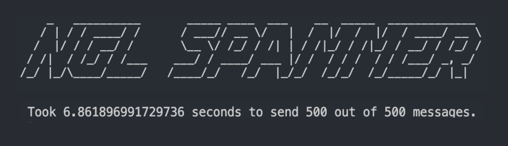
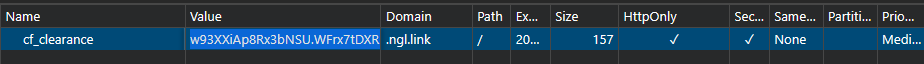
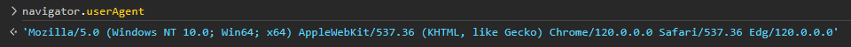

# Extremely Fast NGL Spammer

NGL Spammer is a command-line interface (CLI) application written in Python that allows you to spam people in the NGL community with a specified username and count.

## Performance

This NGL Spammer is optimized for exceptional speed, capable of sending 500 messages in around 5 - 6 seconds. Leveraging the power of `aiohttp` and `asyncio`, it excels in quickly and efficiently sending multiple requests concurrently.


## Installation

1. Clone the repository:

    ```bash
    git clone https://github.com/JethroNatividad/ngl-spammer.git
    ```

2. Navigate to the project directory:

    ```bash
    cd ngl-spammer
    ```
3. Create a virtual environment:

    ```bash
    python -m venv env
    ```

4. Activate the virtual environment:

    On Windows:

    ```bash
    .\env\Scripts\activate
    ```

    On Linux and Mac:

    ```bash
    source env/bin/activate
    ```

5. Install the required dependencies using pip:

    ```bash
    pip install -r requirements.txt
    ```

## Usage

Before running the NGL Spammer, ensure you have obtained the necessary Cloudflare cookie and user agent.

### Getting `Cloudflare` Cookie

1. Visit [ngl.link](https://ngl.link).
2. Complete the CAPTCHA if prompted. If not, it is often automatically completed.
3. Right-click anywhere on the page and select "Inspect" or press `F12` to open the developer tools.
4. Go to the "Application" tab.
5. In the left sidebar, under "Storage," expand the "Cookies" section.
6. Look for a cookie named `cf_clearance`. Copy the value.


7. Replace the value in `clearance.txt` with the copied `cf_clearance`.

Please note that due to the security measures on [ngl.link](https://ngl.link), you might need to repeat the process above approximately every 30 minutes.

### Getting `User Agent`
1. In the developer tools, navigate to the "Console" tab.
2. Type `navigator.userAgent` and press Enter.

3. Copy the displayed user agent. Make sure not to include the single quotes `''` around the user agent.
4. Paste the user agent into the `user_agent.txt` file.


To run the NGL Spammer, use the following command:


```bash
python main.py -u <target_username> -c <spam_count>
```

Replace `<target_username>` with the NGL username you want to spam and `<spam_count>` with the number of spam messages you want to send.

### Example:

```bash
python main.py -u john_doe -c 100
```

### Alternatively, you can run the file directly:

```bash
python main.py
```

### Additional Options:

- `--help`: Display help and information about available parameters.

```bash
python main.py --help
```

## Customizing Messages

You can customize the messages sent by editing the `messages.txt` file. Each line in this file represents a separate message, and the spambot will randomly select messages from this file to send.

To add or remove messages, simply edit the `messages.txt` file with your desired texts.

## Disclaimer

**Use this tool responsibly!** The NGL Spammer is intended for educational and testing purposes only. Misuse of this tool for spamming or any malicious activities is strictly discouraged. The developer is not responsible for any consequences resulting from the misuse of this application.

## License

This project is licensed under the [MIT License](LICENSE) - see the [LICENSE](LICENSE) file for details.
